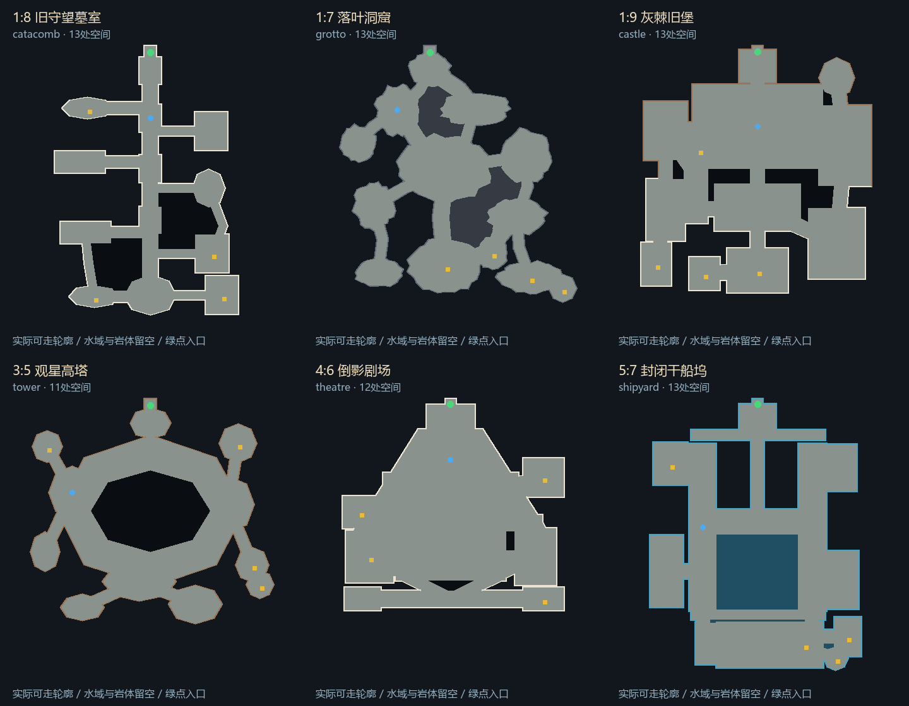

# 副本空间类型重做（v7）

2026-10-10。上一轮v6虽然扩大副本并添加地编，仍共用15个房间的格状骨架和四段固定高差，墙体默认包围整个轮廓。这使墓室、矿洞、城堡和工场的探索节奏过于相似。本轮重做30个室内区域的空间数据、对应可编辑场景和光照；19个室外区域与六个营地延续前版。

## 实际变化

现在有22种空间类型，30份不同的地面/空洞轮廓，13种包络尺寸，每区10—14处功能空间。真实可走面积约3705—9103平方米；空间数量与面积是描述数据，不是视觉质量分数。角色比例和正常游戏镜头不变，比较截图采用更大的视野观察主要空间。

这是JSON中真实可走轮廓的投影，绿色入口、蓝色传送点、金色宝箱；并非概念图。[全部30区图集](dungeon-identities-atlas.png)。修改空间数据后重新运行draw_dungeon_identities.py同步图集。

| 副本类型 | 空间组织 | 边界与高差 |
| --- | --- | --- |
| 墓室、花冢 | 长甬道、深浅不一的墓龛支线、陪葬侧厅与局部回路 | 埋藏墙体，逐段下行；花冢侧室增加曲线和分支 |
| 矿窟、矿井 | 曲折洞道、大小不一的岩腔、岩体分隔与偏置支洞 | 连续岩壁、不可走外围基岩、缓坡下降 |
| 旧堡、地下城 | 前庭、守卫/军械翼、大厅、王座厅与后院 | 旧堡庭院使用断墙和较亮月光，地下城改封闭分隔；通往主厅的连续阶梯 |
| 礼拜堂、法庭、圣殿 | 纵向中殿、横向耳堂、后殿回廊；法庭有圆形审议大厅 | 主祭区域升高；不同分支与中央结构 |
| 修道院、长廊 | 庭院周边回廊、翼楼、抄写室、食堂和独立侧厅 | 内院拱廊与低于步道的泥土；月蔷/白骨版本改变通道组合 |
| 书库、旧宅、誓词书库 | 阅览大厅与书架行列；旧宅增加房间分隔，誓词书库使用八角阅读空间和支廊 | 封闭墙体、不同功能摆放；主轴与分支比例不同 |
| 工厂、铸造厂、泵房 | 横向连续设备大厅、检修湾、出渣/装卸支厅 | 工艺沟、设备井、栏杆；高差沿东西方向变化 |
| 高塔、灯塔、星仪站 | 中央塔芯周围的环廊、放射侧厅、外侧仪器台 | 断墙、栏杆、局部拱廊；灯塔圆环与观星塔八角环区分 |
| 剧场 | 扇形观众厅、横向观众通道、主舞台、两侧台与后台 | 看台缓升至舞台阶梯；座位行列沿地面高度落点 |
| 温室、面具藏馆 | 不规则种植园、偏置支湾；藏馆则为斜轴展廊和椭圆主展厅 | 温室开放边缘、根系与栏杆，展馆封闭墙体 |
| 船坞、潮下遗迹 | 狭长双堤、横向过桥、主水槽和旁侧工棚 | 栏杆替代外围高墙，水面低于堤道且保持水平；遗迹保留外围墙体 |
| 圣物库 | 偏轴前殿、十字封印厅、内环与独立圣室 | 中央封印核心、两段上行与实体边界 |

## 同源制作与编辑

`resources/story-exploration.json`仍为运行时权威布局。新增`layout_family`、`layout_revision=2`、`grade_axis`、`edge_styles`、`void_surface`、`sky_open`字段。房间图、角色高度、道具占地、敌群、探索图与地面同时读取该文件；每条外轮廓/空洞边都有对应的墙、断墙、拱廊、栏杆、岩壁或开放边样式。水域和岩体不属于可走地面。

`tools/author_dungeon_identities.py`是一次性离线制作工具，拒绝二次覆盖，首轮输入备份到忽略的build目录。正常编辑直接修改JSON或指定场景；`refine_dungeon_identity_compositions.py`记录实机检查后的庭院组合与剧场高程调整。两者仅需要离线Shapely，不增加游戏依赖。

`story_exploration_environment.gd`根据边样式装配现有模型；可走地板和阶梯支持X/Y两种高差方向。天然洞窟外围另建不可走、排除固定GI的基岩表面，避免整片洞道悬在黑色空白上。外围与中央岩体使用轻微纹理调制的冷色补光；增量工具`patch_dungeon_bedrock_fill.gd`先核对部件没有静态GI用户，仅调整这两场的未烘焙材料，保留地板光照。水面取该槽边的最低高度，再下移110厘米；不会随楼梯变成斜水面。固定地板继续生成UV2并重新烘焙。

只更新副本：`tools/Build-Exploration-Scenes.ps1 -DungeonsOnly`，然后`tools/Bake-Exploration-Scenes.ps1 -DungeonsOnly`。制作时不要覆盖未保存的人工场景编辑；首轮重做前工作树只有用户PV文件未跟踪。本轮未修改该文件或原Blender权威源文件。

实际通路检查仍覆盖每个功能空间、任务点、传送点、宝箱以及副本上下层入口；缓存检查核对空间类型、修订号、地板边界、道具与GI。`tests/story_dungeon_identity.gd`单独检查整体结构差异、边样式实际模型、水槽实体和缓存身份，不能只靠地图名字不同就通过。

`tools/draw_dungeon_identities.py`绘制真实可走轮廓对照及30区图集；`tests/story_exploration.gd --photos-only --identity-photos`输出12个实际游戏机位。`Preview-Dungeons.cmd`可选择幕与具体地图，不写正式存档；发布版为`dist/CrimsonTide-ForwardPlus-v7.exe`，原v6保留。

## 完成边界

这一轮改变了空间结构、通行节奏、边界表现与实际地编，模型模块仍使用已有原创库。没有新增跨层重叠桥、连续五层塔楼、独立解谜或专属Boss招式。环形塔廊是单地图空间，不应称为完整多层螺旋塔。不同幕仍有少量同类模块和材质复用，雕刻细节与材质精修仍有提升空间。长时间性能验收继续暂缓，4K机位截图不证明4K60。

具体测试、实际烘焙、导出与启动结果见TEST-REPORT最后一节。
